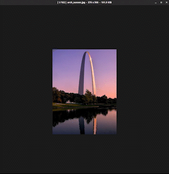

# Nifty Seam Carving

A cli app for content aware seam carving of an image based
on [this nifty](http://nifty.stanford.edu/2015/hug-seam-carving/) written in [Rust](https://www.rust-lang.org).

## Results:



## Command-line Options:

### Options:

- `-i <input>`, `--input <input>`: Path to input file
- `-o <output>`, `--output <output>`: Path to output file
- `-m <mode>`, `--mode <mode>`: The mode for seam carving (`vertical` or `horizontal`)
- `-p <passes>`, `--passes <passes>`: The number of passes (seams to carve)

### Flags:

- `--debug`:  Enables debug mode. Writes out images of the energy map and seams.

## Build:

This program is written in [Rust](https://www.rust-lang.org/). The Rust compiler can be installed by following the
instructions on the [official download page](https://www.rust-lang.org/tools/install).

```shell
# Clone the repo
$ git clone "https://github.com/edzdez/nifty-seam-carving.git"
$ cd nifty-seam-carving

# Build with cargo
$ cargo build --release
$ ./target/release/nifty-seam-carving {OPTIONS}

# Alternatively, to build and run in one step
$ cargo run --release -- {OPTIONS}
```